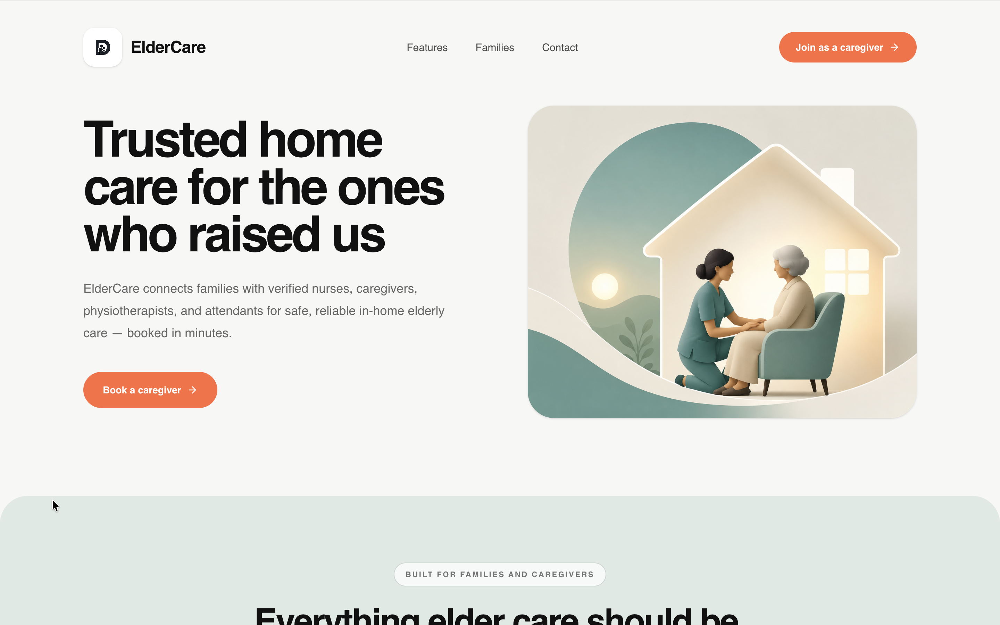
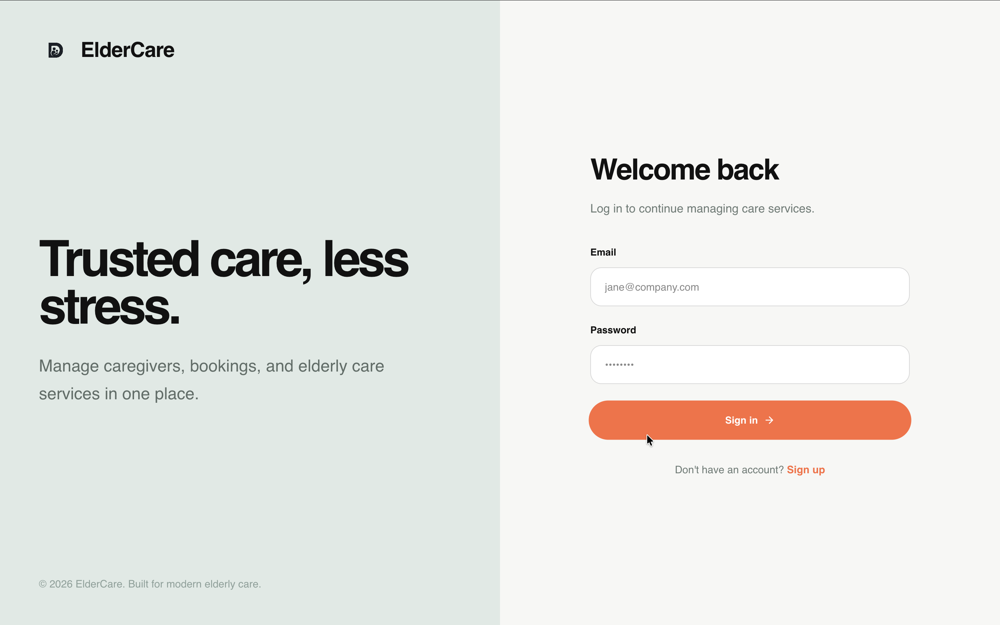
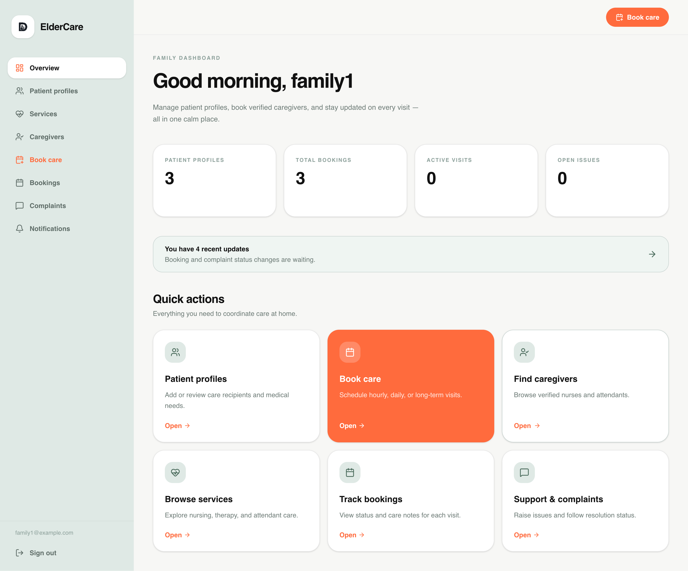
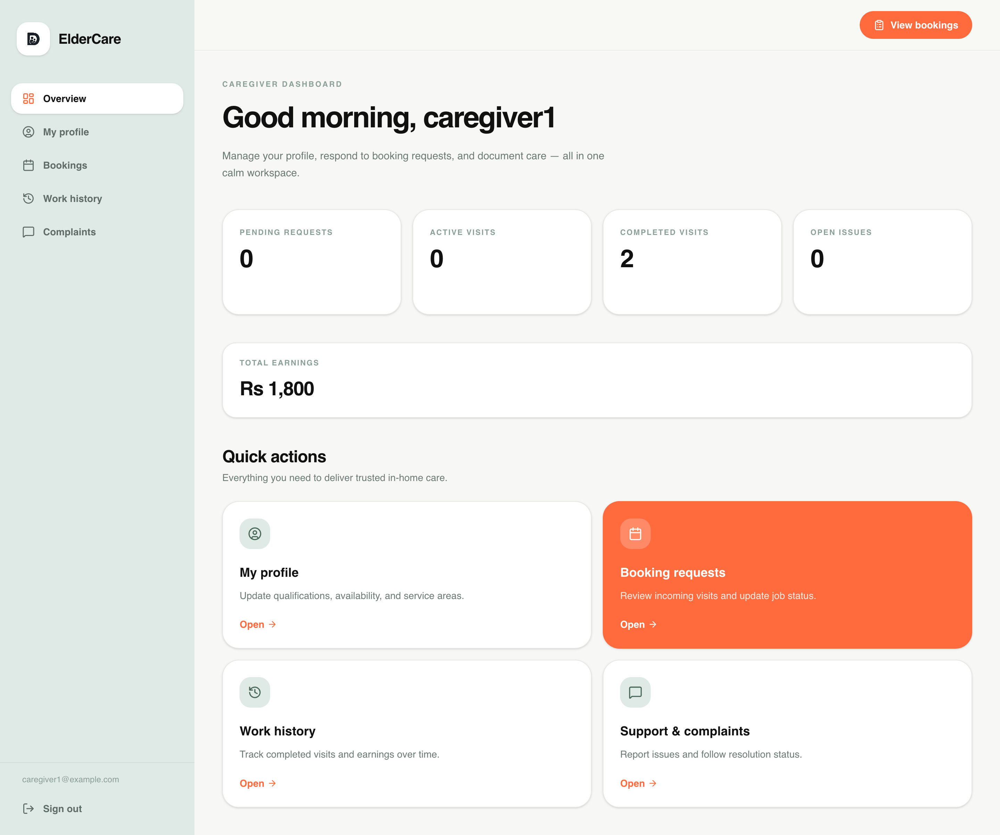
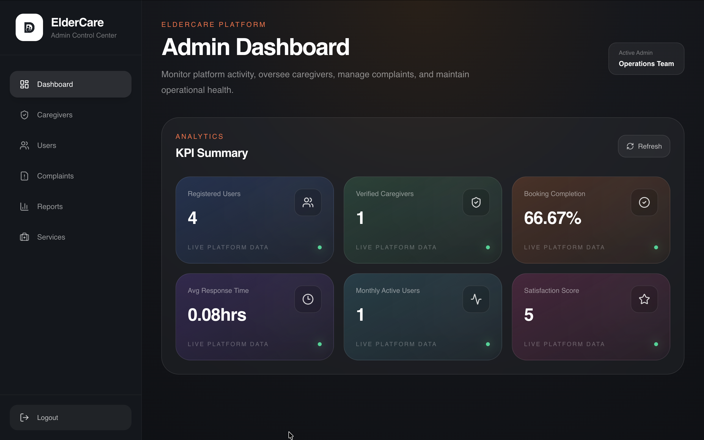
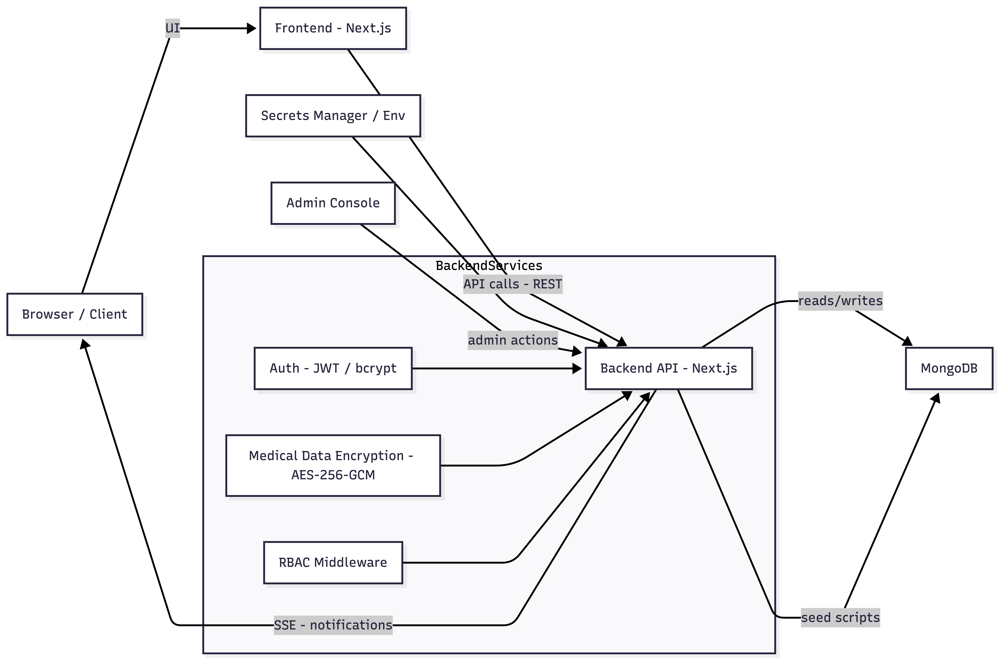
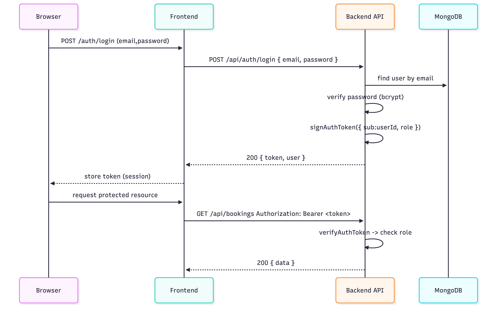

# ElderCare — Elderly Nursing & Healthcare Assistance Platform

> A full-stack healthtech solution bridging the gap between elderly patients and verified healthcare professionals. Multi-role architecture, production-grade security, and real-time service coordination — built with the MERN stack.

> **Note:** This project is built for educational and portfolio purposes. It demonstrates a scalable healthcare-service platform with secure authentication, caregiver workflows, real-time notifications, and OpenAPI-documented REST APIs.

**Stack:** Next.js · React · TypeScript · Node.js · MongoDB · Tailwind CSS · JWT + bcrypt · AES-256-GCM · OpenAPI 3.0

***

## Table of Contents

- [Features](#features)
- [Screenshots](#screenshots)
- [Quickstart](#quickstart)
- [Environment Variables](#environment-variables)
- [API Documentation](#api-documentation)
- [Architecture](#architecture)
- [Security](#security)
- [Project Structure](#project-structure)
- [Operational Notes](#operational-notes)
- [Roadmap](#roadmap)

***

## Features

Three portals, one platform. Role-specific interfaces give each user exactly what they need — nothing more, nothing less.

### 👤 User / Family

- Secure JWT authentication
- Elderly / patient profile management
- Browse and filter caregivers
- Book nursing services
- Real-time booking lifecycle tracking
- Live status updates via SSE
- Submit caregiver ratings

### 🩺 Caregiver

- Onboarding and profile setup
- Availability and service area configuration
- Accept or reject booking requests
- Update service progress stages
- Add care notes and updates
- View work history and assignments

### 🛡️ Admin

- Caregiver verification and onboarding
- User and service management
- Complaint handling and escalations
- KPI monitoring and analytics
- Role-based access control (RBAC)

***

## 📸 Screenshots

<table>
<tr>
<td width="50%">

### 🌐 Landing Page — `Public`



</td>

<td width="50%">

### 🔐 Login — `Public`



</td>
</tr>

<tr>
<td width="50%">

### 👤 User Dashboard — `User / Family`



</td>

<td width="50%">

### 🩺 Caregiver Dashboard — `Caregiver`



</td>
</tr>
</table>

---

### 🛡️ Admin Dashboard — `Admin`

<p align="center">
  
</p>

***

## Quickstart

**Prerequisites:** Node.js 20+, npm or pnpm, MongoDB (local or Atlas)

### 01 — Clone and install dependencies

```bash
# Backend
cd backend && npm install

# Frontend
cd ../frontend && npm install
```

### 02 — Set up environment variables

```bash
cp backend/.env.example backend/.env
cp frontend/.env.example frontend/.env.local
# Then fill in the values for each file
```

### 03 — Start development servers

```bash
# Terminal A — Backend on port 3000
cd backend && PORT=3000 npm run dev

# Terminal B — Frontend on port 3001
cd frontend && PORT=3001 npm run dev
```

### 04 — Seed initial data

```bash
cd backend
npm run seed:services
npm run seed:admin
# seed:admin requires ADMIN_EMAIL + ADMIN_PASSWORD in .env
```

***

## Environment Variables

### `backend/.env`

| Variable | Description | Default |
|---|---|---|
| `MONGODB_URI` | MongoDB connection string | — |
| `JWT_SECRET` | Secret used for JWT signing | — |
| `JWT_EXPIRES_IN` | Token expiry duration | `7d` |
| `MEDICAL_DATA_ENCRYPTION_KEY` | Base64 encoded 32-byte AES-256-GCM key | — |
| `FRONTEND_URL` | Allowed frontend origins for CORS | — |
| `ADMIN_EMAIL` | Admin bootstrap email (seed:admin) | — |
| `ADMIN_PASSWORD` | Admin bootstrap password (seed:admin) | — |

### `frontend/.env.local`

| Variable | Description | Default |
|---|---|---|
| `NEXT_PUBLIC_API_BASE_URL` | Backend API base URL | `http://localhost:3000` |

> ⚠️ **Never commit:** `JWT_SECRET` · `MEDICAL_DATA_ENCRYPTION_KEY` · Admin credentials · Production database URLs.
> Use a secure secrets manager (Doppler, Vault, etc.) in production environments.

***

## API Documentation

The backend ships a complete OpenAPI 3.0 specification at `backend/openapi.yaml`, covering all REST modules.

**Modules covered:**

- JWT Authentication
- Booking Lifecycle
- Caregiver Onboarding
- Complaint Workflows
- SSE Notifications
- Admin Analytics
- Patient Profiles
- Medical Data
- Services Catalog

### Run Swagger UI locally

```bash
cd backend
npm install swagger-ui-express yamljs
```

```typescript
import swaggerUi from "swagger-ui-express";
import YAML from "yamljs";

const swaggerDocument = YAML.load("./openapi.yaml");
app.use("/docs", swaggerUi.serve, swaggerUi.setup(swaggerDocument));
```

Then open `http://localhost:3000/docs`. The spec can also be imported into Postman, Insomnia, Swagger Editor, Redocly, or OpenAPI Generator.

***

## Architecture

### System Diagram

> A high-level view of the full-stack request lifecycle, from the frontend down to MongoDB.



### Auth Sequence

> JWT-based authentication flow — from login request to protected route access.



**Design highlights:**

- Modular API route organization by domain
- Role-based access control (RBAC) at middleware level
- AES-256-GCM encryption for medical data at rest
- Real-time updates via Server-Sent Events (SSE)
- Centralized API response structure
- Environment-driven configuration, no hardcoded secrets

***

## Security

| Primitive | Details |
|---|---|
| **JWT Authentication** | Stateless token-based auth with configurable expiry and protected route middleware |
| **bcrypt Password Hashing** | Salted hashing via bcryptjs. No plain-text passwords stored or logged anywhere |
| **AES-256-GCM Encryption** | Sensitive medical data encrypted at rest with a 32-byte base64-encoded key |
| **RBAC Authorization** | Admin-only actions are guarded at the middleware level, not just the UI layer |
| **Admin Bootstrapping** | Idempotent `seed:admin` script prevents accidental privilege escalation on re-runs |
| **SSE Stream Protection** | Notification streams require valid JWT. Heartbeat keeps connections alive on proxies |

***

## Project Structure

```
backend/
  scripts/              seed:services, seed:admin
  src/
    app/api/
      auth/             POST /login, /register
      bookings/         Booking lifecycle + ratings
      caregivers/       Profile, work-history, availability
      complaints/       Raise + resolve complaints
      notifications/    SSE stream + status-updates
      patients/         Patient profile management
      services/         Healthcare services catalog
      admin/            Users, caregivers, analytics, reports
    controllers/        HTTP request / response handlers
    models/             Mongoose schemas
    services/           Business logic
    lib/                MongoDB connection, encryption utils
    middleware/         Auth, RBAC, error handling

frontend/
  src/app/
    admin/              Admin portal pages
    caregiver/          Caregiver portal pages
    user/               User / family portal pages
    login/              Auth screens
    register/
  src/components/       Shared UI components
  src/lib/              API client, utilities
  src/types/            TypeScript type definitions

backend/openapi.yaml    Full OpenAPI 3.0 specification
```

***

## Operational Notes

> **Important things to know before deploying:**

- `MEDICAL_DATA_ENCRYPTION_KEY` must be a valid base64-encoded 32-byte key — generate with `openssl rand -base64 32`
- SSE streams require response buffering to be disabled on reverse proxies (Nginx: `proxy_buffering off`)
- `seed:admin` is idempotent — safe to re-run, it will not create duplicate admins
- Frontend and backend must run on separate ports; configure `FRONTEND_URL` correctly for CORS

The backend connects to a MongoDB database named `elderly_nursing_platform` via the connection utility at `backend/src/lib/mongodb.ts`.

***

## Future Roadmap

- Online payments & insurance integrations
- Native mobile applications (React Native)
- Tele-consultation with doctors
- Medication reminder system
- Emergency SOS workflows
- AI-powered caregiver recommendations
- Advanced analytics dashboards
- Multi-language / accessibility improvements

***

*Built for educational & portfolio purposes · MERN Stack · Next.js · TypeScript · OpenAPI 3.0*